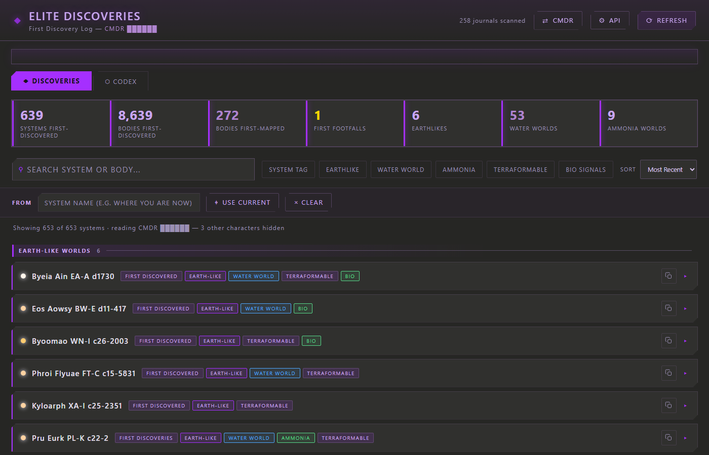

# Elite Discoveries

*Built with [Claude Code](https://claude.com/claude-code).*

## Download

Grab the latest Windows build from the **[Releases page](../../releases/latest)**:

- **`Elite Discoveries.exe`** — standalone, no Python required. Double-click to run.

See **Run it** below for source-based options.

---

A local tracker for your **first discoveries** in *Elite Dangerous* — the systems
you were the first commander to tag, and the planets/stars within them you
discovered, mapped, or set first footfall on.

Discoveries are read from the game's own **journal files** (so the
`WasDiscovered` / `WasMapped` / `WasFootfalled` credit is authoritative). On first
launch you **pick which commander to read** from a list built out of your journals
— because the folder can hold several Elite Dangerous characters, the app reads
**exactly one** and ignores the rest. No login or API key is required; your choice
is remembered for next time. Nothing leaves your machine.

## What it shows

- **Stats strip** — systems first-discovered, bodies first-discovered/mapped,
  first footfalls, Earthlikes / Water Worlds / Ammonia, total estimated value.
- **System list** — a two-column grid of clean, uniform rows showing just each
  system's name with a one-click **copy** button (paste it straight into the
  in-game galaxy map search). Systems are separated into Codex categories with
  colour-coded headers and row accents: **Earth-Like Worlds**, **Water Worlds /
  Water-Based Life** (blue), **Ammonia Worlds / Ammonia-Based Life** (green),
  **Water + Ammonia** (cyan), **Anomalies** (pink), and Other. The sort dropdown
  orders systems *within* each category. Click a row to expand full-width detail
  (uniform stats + tags) and its bodies, each with a small Codex-style
  holographic wireframe portrait. No credit values are shown anywhere.
- **FROM bar (nearest first)** — type any system you've visited, or press
  **USE CURRENT** to read your present in-game location from the journals. Every
  row then shows its distance in light-years and the list sorts nearest-first,
  grouped into distance bands — ideal for finding your discoveries near where
  you're flying right now.
- **Per-body detail** — a procedurally generated portrait coloured by body
  class, plus full stats (class, atmosphere + composition, gravity, mass,
  radius, temperature, pressure, orbital period, rings, bio/geo signals) and
  badges: First Discovery ◆, First Mapped, First Footfall, Terraformable, Landable.
- **Search / filter / sort** — find a system or body by name, filter by
  Earthlike / Water World / Ammonia / Terraformable / Bio / system-tag, sort by
  most recent, highest value, most bodies, or name.
- **Codex tab** — your in-game **Codex** (Biological/Geological + Astronomical
  discoveries), read from the journals' `CodexEntry` events. Grouped by category
  and sub-category, with region, system, body, date, and a "first logged" flag.

## The Codex (and why the Frontier login is *not* how you get it)

Your Codex is written to the journals as `CodexEntry` events, so the **Codex tab
reads it directly — no login or API key**. This is separate from the Frontier
"login portal" (the OAuth Companion API that Inara uses): that returns your
*current* profile/ship/market only and **never exposes the Codex**. Getting a
Frontier OAuth `client_id` is also a manually-approved, restricted process — so it
is neither required nor sufficient for Codex data. Codex = journals, full stop.

## Requirements

- **Python 3** (already detected on this machine). No other installs — standard
  library only.
- Your Elite Dangerous journal folder (default
  `%USERPROFILE%\Saved Games\Frontier Developments\Elite Dangerous`).
- *(Optional)* an Inara or EDSM API key only if you want the CMDR **profile** card.
  (There is no end-user Elite Dangerous/Frontier API — see below.)

## Run it

### As a standalone app (recommended — no Python needed to run)

1. Run **`scripts\build_exe.bat`** once. It builds **`Elite Discoveries.exe`**
   — a single self-contained executable (the `web/` UI is bundled in; Python is
   only needed for this build step, not to run the result).
2. Run **`Create Desktop Shortcut.bat`** to drop an **Elite Discoveries** icon on
   your Desktop (pin it to the taskbar if you like).
3. Double-click it. It starts the local server and opens the app in its **own
   window**; closing the window stops everything. Your selected commander and any
   keys are saved in `%LOCALAPPDATA%\EliteDiscoveries\config.json`, so they persist
   across rebuilds.

The window is a real native OS window (via `pywebview` / Edge WebView2 — a true
application window, no tabs or address bar). If that backend isn't available it
falls back to a Chromium "app-mode" window (Chrome/Edge/Brave/Opera/Vivaldi —
auto-detected), then to your default browser. Set `ED_NO_NATIVE=1` to skip
straight to the Chromium/browser path.

### Without building (uses your installed Python)

- **Own window:** double-click **`Elite Discoveries (Desktop).bat`** (runs
  [`src/desktop.py`](src/desktop.py)). `Install Elite Discoveries.bat` makes
  shortcuts. `scripts\run.bat` also does this and bootstraps a local `.venv`
  with dependencies (including `pywebview`) on first run.
- **Browser tab:** double-click **`Start Elite Discoveries.bat`**, or
  `python src\server.py`, then open `http://127.0.0.1:8765/`.
- **Screenshot/stream-safe mode:** append `?redact=1` to the URL to mask the
  commander name in the UI (e.g. `http://127.0.0.1:8765/?redact=1`).

Press **REFRESH** after a flight to re-scan your journals for new discoveries.

## Configuration

Set environment variables before launching:

| Variable   | Purpose                            | Default |
|------------|------------------------------------|---------|
| `ED_PORT`  | Port for the local web server      | `8765`  |

## How "first discovery" is determined

Only the **attached commander's** scans are read — as the journals are parsed,
the active commander (from each `Commander` / `LoadGame` event) is tracked, and
scans logged while a *different* character was playing are skipped. The earliest
scan of each body is then kept (a later re-scan would read as already-known):

- **First-discovered body** — that scan had `WasDiscovered: false`.
- **System first-discovered** — you first-scanned the system's main star
  (the in-game "Discovered by CMDR" tag).
- **First-mapped body** — you completed a surface (DSS) scan and the body's scan
  had `WasMapped: false`.
- **First footfall** — a landable body with `WasFootfalled: false`.

If the attached name matches no commander in the journals, the app lists the
names it *did* find so you can attach the right one (names are case-insensitive).
Scan values are an **estimate** (Horizons/Odyssey ballpark) and labelled as such.

## Selecting a commander

On first launch you'll see **SELECT YOUR COMMANDER** with a button per character
found in your journals. Click one and it's remembered (`config.json`); only that
commander's discoveries are read. Switch any time with the top-bar **⇄ CMDR**
button. No API or login involved.

## Optional: CMDR profile (Inara / EDSM)

The **API** button adds a profile card (ranks, allegiance, squadron, ship) above
your log — purely cosmetic, never required.

> **There is no end-user Elite Dangerous / Frontier API key.** Frontier's
> Companion API needs a developer `client_id` and returns only your *current*
> ship/ranks, never a discovery history. So the profile can come from **Inara** or
> **EDSM** (your own key); the **Frontier login** stays disabled unless you supply
> a developer `client_id`.

Open the panel, paste
a key, hit **Save & Fetch CMDR**, and a profile card appears under the header.

Credentials are stored only in `config.json` on this machine and are **never sent
back to the browser** (the UI only ever sees "key saved: yes/no"). All lookups
are made server-side, so they work without browser CORS limits.

| Provider | What you need | Where to get it |
|----------|---------------|-----------------|
| **Inara** | personal API key + CMDR name | [inara.cz › Settings › API keys](https://inara.cz/settings-api/) |
| **EDSM** | CMDR name (key optional; needed for credits/position) | [edsm.net › Settings › API](https://www.edsm.net/en/settings/api) |
| **Frontier** | OAuth `client_id` (advanced) | see below |

### Frontier login — the OAuth flow Inara uses

Inara imports live data via Frontier's **Companion API**, an OAuth2 + PKCE login
against `auth.frontierstore.net`. This app implements that flow
([`src/frontier_oauth.py`](src/frontier_oauth.py)): **API → Frontier login → Connect with
Frontier** sends you to Frontier's site, then reads your commander profile from
`companion.orerve.net`.

The catch: Frontier issues OAuth `client_id`s only to approved developers
([user.frontierstore.net](https://user.frontierstore.net/)), and the redirect URI
you register must match `http://127.0.0.1:8765/oauth/callback`. Paste your
`client_id` in the Advanced section to enable the button. Without one, this stays
disabled and the Inara/EDSM key hooks are used instead — that is a Frontier
restriction, not a limitation of this tool.

## Files

| File                 | Purpose                                             |
|----------------------|-----------------------------------------------------|
| `src/journal_parser.py` | **Discovery data source** — parses local journals → first-discovery model. |
| `src/codex_parser.py`   | **Codex source** — parses `CodexEntry` events → codex model. |
| `src/api_clients.py`    | Optional Inara + EDSM CMDR-profile hooks.           |
| `src/frontier_oauth.py` | Frontier Companion API OAuth2 (PKCE) login (optional, needs client_id). |
| `src/edsm_data.py`      | EDSM get-logs/bodies source (kept for reference; not wired in). |
| `src/server.py`         | Stdlib HTTP server + JSON API (data, config, cmdr, oauth). |
| `src/desktop.py`        | **Standalone desktop client** — native OS window (pywebview) with Chromium/browser fallback; runs the server + own app window. |
| `src/make_icon.py`      | Generates `assets/elite-discoveries.ico` (stdlib, no Pillow). |
| `src/web/`              | The single-page UI (HTML/CSS/JS, no frameworks). Supports `?redact=1` to mask the commander name. |
| `scripts/build_exe.bat` | Builds `Elite Discoveries.exe` (top level, PyInstaller, one-file, windowed). |
| `scripts/run.bat`       | Dev/no-build launcher — bootstraps a local `.venv` then runs `src/desktop.py`. |
| `scripts/requirements.txt` | `pywebview` (native window, optional) + build-time PyInstaller. The app itself otherwise needs only the stdlib. |
| `scripts/install.ps1`   | Creates the Desktop/Start-Menu shortcuts (invoked by `Install Elite Discoveries.bat`). |
| `assets/elite-discoveries.ico` | App icon used by shortcuts and the built `.exe`.  |
| `Create Desktop Shortcut.bat` | Desktop shortcut → the built `.exe`.       |
| `Create Shortcut.bat` | Desktop shortcut → the built `.exe` if present, else `scripts\run.bat`. |
| `Elite Discoveries (Desktop).bat` | Launch via installed Python (no build).|
| `Install Elite Discoveries.bat` | Runs `scripts\install.ps1` to make shortcuts. |
| `Start Elite Discoveries.bat` | Browser-mode launcher.                     |
| `config.json`        | Local state (selected commander, optional keys); source runs read/write `src/config.json` (next to `server.py`), the `.exe` uses `%LOCALAPPDATA%\EliteDiscoveries\`. |

## Theme

The UI uses the **"Tats Stealth Purple"** EDHM-UI palette — vivid violet
(`#A52FFF`) and soft lavender (`#AF84CF`) with gold (`#FFD800`) and red (`#E61B1B`)
accents, decoded from the EDHM theme file — over the warm **Claude grey**
background (`#262624` / `#30302E`). Panel styling follows the Elite Dangerous UI
language: chamfered corners, solid-fill active tabs and button hovers with dark
text, and section headers with rule lines. The colors live in CSS variables at
the top of [`src/web/style.css`](src/web/style.css) if you want to tweak them.
